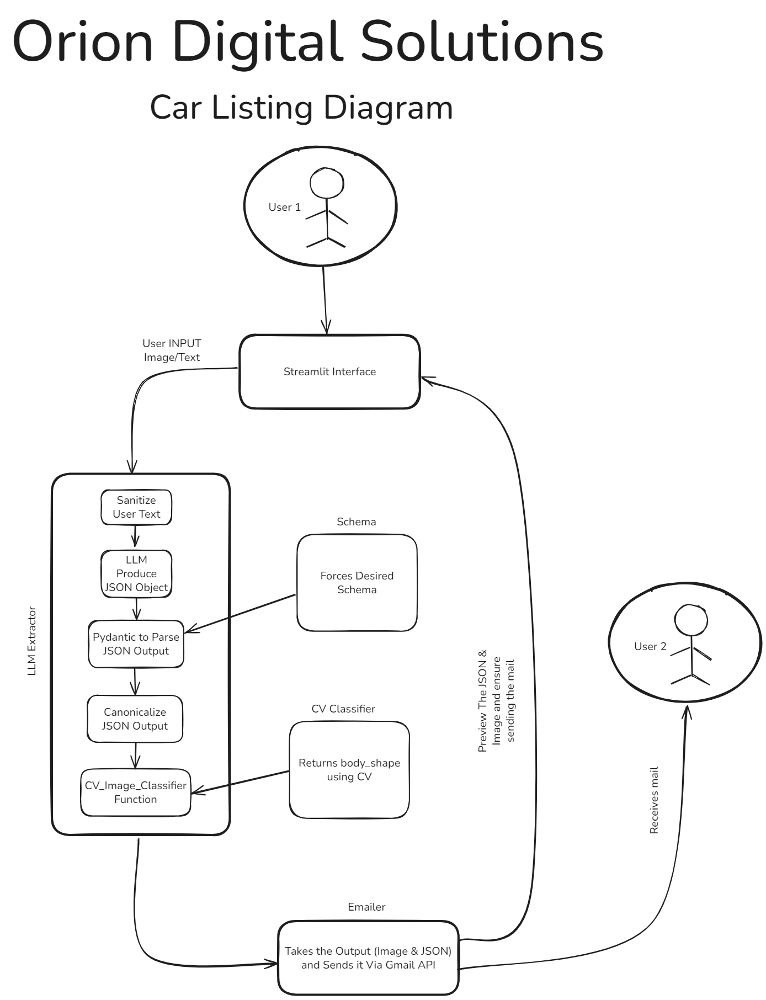

# Car Listing App

A Streamlit-based application that extracts structured car information from text descriptions and images, then automatically emails the results as JSON with image attachments.

### Explanation Video
Watch the explanation video here: [Explanation Video](https://drive.google.com/file/d/1O2YWf3Dx-jaFfiCSxMBWBw6LeK-P3aI6/view?usp=drive_link)

## How It Works

1. **Input**: User provides a car description (text) and optionally uploads one image
2. **Text Extraction**: Azure OpenAI (GPT-4o mini) extracts structured data from the description
3. **Image Classification**: Basic computer vision classifies the car's body type (currently returns "sedan" as placeholder)
4. **Data Merging**: Combines text-extracted data with image-derived body type
5. **Email Delivery**: Sends the JSON data and image to a configured email address via Gmail API

## Project Structure

```
├── app.py              # Main Streamlit application
├── llm_extract.py      # LLM-based text extraction and data processing
├── schema.py           # Pydantic models defining the car data structure
├── cv_classifier.py    # Computer vision classifier (placeholder implementation)
├── emailer.py          # Gmail API integration for sending emails
├── credentials.json    # OAuth credentials file (not included)
├── token.json          # Cached OAuth tokens (generated automatically)
└── .env                # Environment variables (not included)
```

## Installation

### Prerequisites

- Python 3.8+
- Google Cloud Project with Gmail API enabled
- Azure OpenAI account and deployment

### Step-by-Step Setup

1. **Clone and install dependencies:**

```bash
git clone https://github.com/ANBadawy/Orion-Car-Listing-App.git
```
2. **Create and activate a virtual environment**:
```bash
# Windows
python -m venv env
env\Scripts\activate

# Linux/Mac
python3 -m venv env
source env/bin/activate
```
3. **Install required packages**:
```bash
pip install -r requirements.txt
cd car-listing-app
```


4. **Configure Google Gmail API:**
   - Create a Google Cloud Project
   - Enable the Gmail API
   - Create OAuth 2.0 credentials (Desktop Application)
   - Download the credentials as `credentials.json`

5. **Set up Azure OpenAI:**
   - Deploy GPT-4o mini model in Azure OpenAI
   - Note your endpoint, API key, deployment name, and API version

6. **Create `.env` file:**
```env
# Azure OpenAI Configuration
AZURE_OPENAI_API_KEY=your_api_key_here
AZURE_OPENAI_ENDPOINT=https://your-resource.openai.azure.com/
AZURE_OPENAI_DEPLOYMENT=your-deployment-name
AZURE_OPENAI_API_VERSION=2025-01-01-preview

# Email Configuration
GMAIL_TO=recipient@example.com
EMAIL_SUBJECT_PREFIX=your-prefix-here
GMAIL_CREDENTIALS_PATH=credentials.json
GMAIL_TOKEN_PATH=token.json
```

## Usage

### Running the Application

```bash
streamlit run app.py
```

### Using the Interface

1. **Enter Car Description**: Type a natural language description of the car in the text area
   - Example: "Blue Ford Fusion produced in 2015 featuring a 2.0-liter engine. The vehicle has low mileage with only 40,000 miles on the odometer. Equipped with brand-new all-season tires manufactured in 2022. The car's windows are tinted for added privacy. Notably, the rear bumper has been replaced after a minor collision. Priced at 1 million L.E."

2. **Upload Image** (Optional): Click the ➕ button to attach one car image (PNG, JPG, JPEG, WebP, BMP, TIFF)

3. **Send**: Click the "Send" button to process the information

4. **Results**: The app will display:
   - Original text input
   - Extracted JSON data
   - Image preview
   - Email delivery status

### Sample Output JSON

```json
{
  "car": {
    "body_type": "sedan",
    "color": "Blue",
    "brand": "Ford",
    "model": "Fusion",
    "manufactured_year": 2015,
    "motor_size_cc": 2000,
    "tires": {
      "type": "brand-new",
      "manufactured_year": 2022
    },
    "windows": "tinted",
    "notices": [
      {
        "type": "minor collision",
        "description": "The rear bumper has been replaced"
      }
    ],
    "price": {
      "amount": 1000000,
      "currency": "L.E"
    }
  }
}
```

## Data Schema

The application extracts the following car information:

### Car Object
- **body_type**: Car body style (from image classification)
- **color**: Car color
- **brand**: Car manufacturer
- **model**: Car model name
- **manufactured_year**: Year of manufacture (1950-2100)
- **motor_size_cc**: Engine size in cubic centimeters
- **tires**: Tire information (type, manufactured year)
- **windows**: Window type ("tinted", "electrical", "manual", "none")
- **notices**: Array of damage/accident notices
- **price** OR **estimated_price**: Price information (amount, currency)

### Business Rules

- Currency is normalized to "L.E" for Egyptian pounds
- Engine sizes are converted from liters to CC (e.g., "2.0-liter" → 2000)
- Price amounts are converted to integers (e.g., "1 million" → 1000000)
- Window types are standardized using synonym mapping
- Only one price field is kept based on description wording

## Components

### `app.py` - Main Application
- Streamlit interface and user interaction
- Session state management
- Form handling and file uploads
- Integration of all components

### `llm_extract.py` - Text Processing
- Azure OpenAI integration for structured extraction
- Input sanitization and prompt injection protection
- Pydantic-based output validation with repair mechanisms
- Business rule enforcement and data normalization

### `schema.py` - Data Models
- Pydantic models defining the car data structure
- Type validation and constraints
- Enum definitions for standardized values

### `cv_classifier.py` - Image Processing
- Computer vision classification (placeholder)
- Currently returns "sedan" for any provided image
- Designed to be replaced with actual ML model

### `emailer.py` - Email Integration
- Gmail API authentication and token management
- Email composition with JSON and image attachments
- MIME type detection for attachments

## Error Handling

- **Input Validation**: Pydantic models ensure data integrity
- **LLM Errors**: Automatic retry with repair prompts for invalid JSON
- **Image Processing**: Graceful handling of invalid/corrupted images  
- **Email Failures**: Clear error messages for authentication/sending issues
- **Prompt Injection**: Sanitization prevents malicious input manipulation

## Solution Design Diagram


